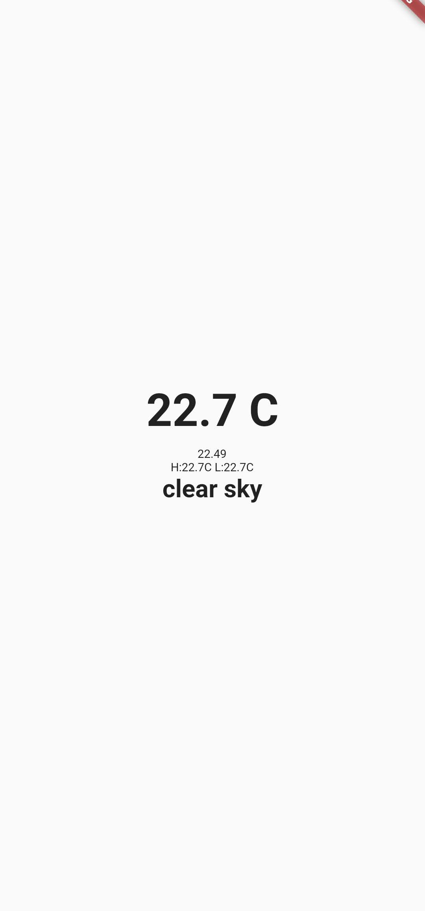

<h1 align="center">
  🌦 Simplest Weather App with Flutter 🌩 
  <h3 align="center">A beginner flutter project with OpenWeather API</h3>
</h1>
 
 

  

 
 

<h6 align="center"> Made with ❤️ by Akif Islam </h6>
